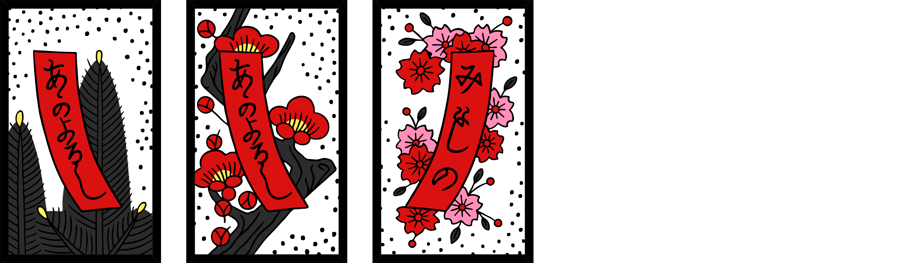
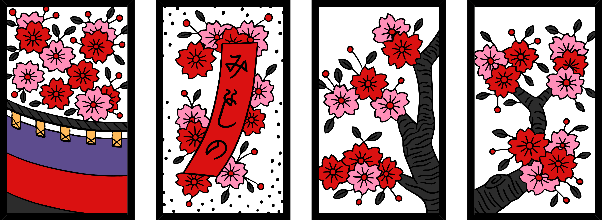
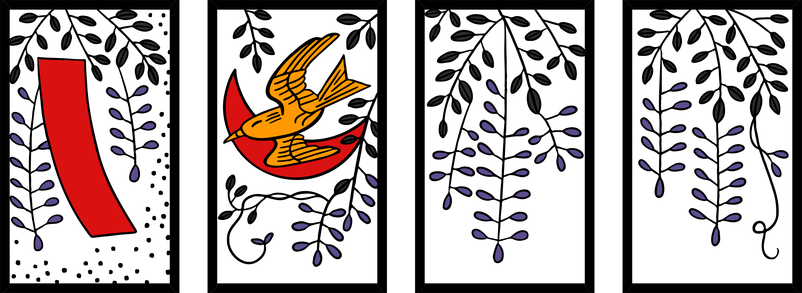
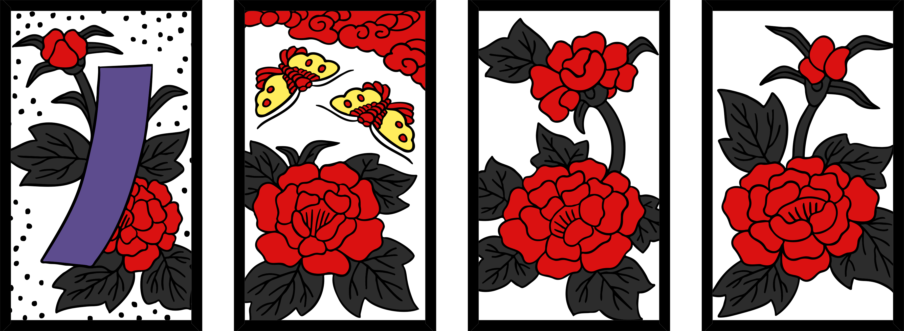
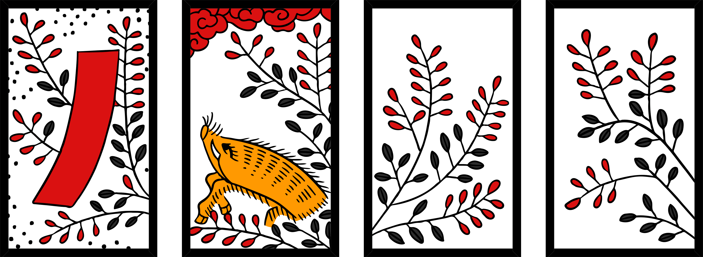
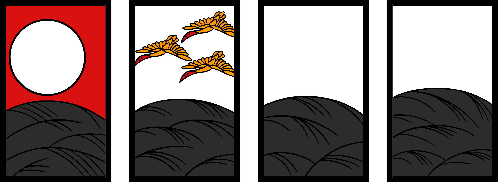
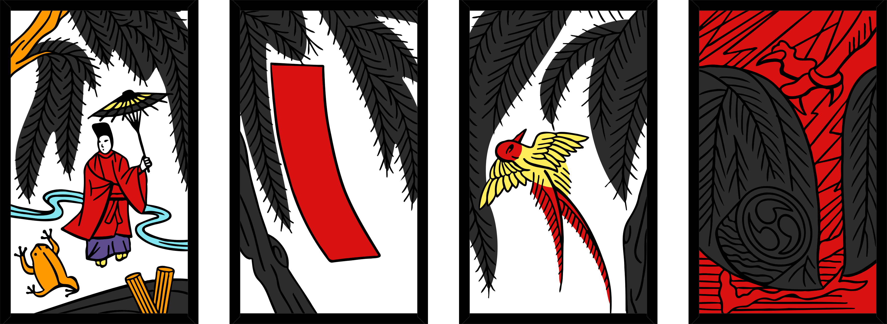

## You will need
- A set of hanafuda

!note: The rules to Hana-awase are similar to [Koi-koi](../koikoi/index.html).

## Terms
- **hanafuda** - the name of the deck of cards.
- a **month** - 1 of the 12 ranks that makes up the deck.
- the **Oya** (親, parent) - the dealer.
- **Field** - the face-up cards in the middle of the table.
- **Draw pile** - the pile of cards remaining from the deal, placed next to the field.
- **Point pile** - where you put your matched cards on the table.
- a **yaku** - special combinations of cards that score points.

## Deal
Choose an Oya by having all players pick a random card from the deck. Whichever player has the earliest Month is the Oya. Retry on a draw.

The Oya deals out the cards:

~For 2 players: Deal 10 cards to each player, and 8 cards to the field.

~For 3 players: Deal 7 cards to each player, and 6 cards to the field.

~For 4 players: Deal 5 cards to each player, and 8 cards to the field.

If 4 cards of the same month are dealt to the field, re-deal the round.

Set the rest of the cards aside to form the draw pile.

## Play
Play begins with the Oya, with each turn having two stages:

1. Match 1 card from your hand with a card on the field, or place a card on the field if you cannot make a match.
2. Match 1 card from the top of the draw pile with a card on the field, or place the card on the field if you cannot make a match.

At either stage of your turn:

- If you have a choice between 2 cards on the field to match with, you must choose 1 to collect.
- If you have a choice between 3 cards on the field to match with, you must collect all 3.

Matched cards then go to your point pile, face up.

!tip: It's a good idea to organise your point pile into the different Types to help you identify yaku.

Play continues counter-clockwise until the draw pile is exhausted.

## Scoring
A player's score for the round is calculated by adding up the card points, plus the yaku points in that player's point pile.

**Card points**

For each card in your point pile, add its value to your card score with the following table:

| Type    | Value | # in deck |
|---------|-------|-----------|
| Lights  | 20    | 5         |
| Animals | 10    | 9         |
| Ribbons | 5     | 10        |
| Chaff   | 1     | 24        |

!example: If you have 2 Lights and 4 Chaff in your point pile, then you'd have 44 points.

Then, calculate the value of the yaku in your points pile, and add the two numbers together.

The player with the highest score at the end of each round becomes the Oya for the next round. If there's a tie, it's whoever is earlier in the turn order.

## Yaku
!note: The Light yaku, the Seven Slips and Six Slips yaku, and the Viewing yaku are **each** mutually exclusive, meaning only the highest-valued yaku in each of those groups counts towards scoring.

### Light yaku
**Five Lights (5 light cards)** - 100 points

**Four Lights (any 4 light cards)** - 60 points

**Spring Lights (the Jan Light, the Feb Animal, and the Mar Light)** - 30 points

**Pine, Paulownia, Moon** - 20 points

---

### Slip yaku
**Seven Slips (any 7 slips excl. Willow Slip)** - 40 points

**Six Slips (any 6 slips excl. Willow Slip)** - 30 points

**Poetry Slips** - 40 points

**Blue Slips** - 40 points

**Grass Slips (excl. Willow Slip)** - 20 points

---

### Animal yaku
**Boar-Deer-Butterfly** - 20 points

---

### Viewing yaku
**Drinking** - 40 points

**Flower Viewing** - 20 points

**Moon Viewing** - 20 points

---

### Four-of-a-kind yaku
**Willow row** - 10 points

**Wisteria row** - 10 points

**Paulownia row** - 10 points

## Card List

**January** - Pine

!center: Light (Sun) • Slip (Poetry) • Chaff • Chaff

**February** - Plum Blossom

!center: Slip (Poetry) • Animal (Bush warbler) • Chaff • Chaff

**March** - Cherry Blossom

!center: Light (Curtain) • Slip (Poetry) • Chaff • Chaff

**April** - Wisteria

!center: Slip (Red) • Animal (Cuckoo) • Chaff • Chaff

**May** - Iris

!center: Slip (Red) • Animal (Eight-plank-bridge) • Chaff • Chaff

**June** - Peony

!center: Slip (Blue) • Animal (Butterflies) • Chaff • Chaff

**July** - Bush Clover

!center: Slip (Red) • Animal (Boar) • Chaff • Chaff

**August** - Susuki Grass

!center: Light (Moon) • Animal (Geese) • Chaff • Chaff

**September** - Chrysanthemum

!center: Slip (Blue) • Animal/Chaff (Sake Cup) • Chaff • Chaff

**October** - Maple

!center: Slip (Blue) • Animal (Deer) • Chaff • Chaff

**November** - Willow

!center: Light (Rain Man) • Slip (Red) • Animal (Swallow) • Chaff

**December** - Paulownia

!center: Light (Dragon) • Chaff • Chaff • Chaff

## Note-worthy cards
There are 3 note-worthy cards:

- The Bush Warbler acts as a pseudo-Light card for the Spring yaku, but isn't counted as a Light card.
- The Eight-Plank-Bridge is an Animal card, despite it not depicting one.
- The Lightning card is in the November suit, despite it appearing not to depict any willow at a glance.
