## You will need
- A set of hanafuda

!note: The rules to Koi-koi are similar to [Hana-awase](../hanaawase/index.html).

## Terms

- **hanafuda** - the name of the deck of cards.
- a **month** - 1 of the 12 ranks that makes up the deck.
- the **Oya** (親, parent) - the dealer.
- **Field** - the face-up cards in the middle of the table.
- **Draw pile** - the pile of cards remaining from the deal, placed next to the field.
- **Point pile** - where you put your matched cards on the table.
- **"koi-koi"** (こいこい, "Come on!") - the signifier to continue playing the round.
- **"stop"** - the signifier to stop playing the round.
- a **yaku** - special combinations of cards that score points.

## Deal
Choose an Oya by having both players pick a random card from the deck. Whichever player has the earliest Month is the Oya. Retry on a draw.

The Oya deals 8 cards to the other player face down, then 8 cards to the field face up, and then 8 cards face down to themselves. This can be done in any way but is typically done in 2- or 4-card chunks. Set aside the rest of the cards to form a draw pile.

!tip: Since you deal half of the cards in the deck, you can split the deck evenly and hold the exact amount, which may aid dealing since hanafuda are smaller and bulkier than standard western playing cards.

Before starting the round, check for the following 'lucky deals' on the field, and in your hand:

- 4 pairs from 4 months
- 4 cards of 1 month

If a player's hand contains a 'lucky deal', they win 6 points and deal the next round as the dealer. If the field contains a 'luck deal', the round is void and the next round is dealt with the dealer swapping to the other player.

## Play
The game is played across 12 rounds, corresponding to each month (round 1 is January, round 2 is February, etc.).

Play begins with the Oya, with each turn having two stages:

1. Match 1 card from your hand with a card on the field, or place a card on the field if you cannot make a match.
2. Match 1 card from the top of the draw pile with a card on the field, or place the card on the field if you cannot make a match.

At either stage of your turn:

- If you have a choice between 2 cards on the field to match with, you must choose 1 to collect.
- If you have a choice between 3 cards on the field to match with, you must collect all 3.

Matched cards then go to your point pile, face up.

At the end of your turn, if there is a new yaku present, or an improvement to any existing yaku, in your point pile and a player hasn't previously declared "koi-koi" in the current round, you must choose to either "koi-koi" or "stop":

- "koi-koi" - The player calls "koi-koi", and the round continues.
  - By calling "koi-koi", you attempt to make a better yaku for yourself at the risk of your opponent making a new yaku too.
  - If either player had called "koi-koi" in the current round and either player makes a new yaku, or improves upon existing yaku, then the round is over.
- "stop" - The player calls "stop", and the round ends.
  - By calling "stop", you bank the value of your yaku.

If there's no yaku present, then play continues to the next player.

If both players run out of cards to play, the round is void.

When the round is over, the winning player scores the cards in their point pile, and the Oya changes to whoever won the round. Play continues into the next round.

!tip: It's a good idea to organise your point pile into the different Types to help you identify yaku.

## Scoring
A player's score for the round is based on all the yaku in the point pile. There are a couple of special modifiers which may apply as well:

- If a player's score is worth 7 points or more, their score for that round doubles.
- If a player had called "koi-koi" in the current round and the other player makes a yaku, the other player's score for that round doubles.

Both of these conditions may apply, meaning a score could be quadrupled.

## Yaku
!note: The Light yaku is the only group where its yaku are mutually exclusive, meaning only the highest-valued Light yaku counts towards scoring. This doesn't apply to Slip, Animal, or Other yaku.

### Light Yaku
**Five Lights (all light cards)** - 10 points

**Dry Four Lights (4 lights excl. Rain)** - 8 points

**Wet Four Lights (4 lights incl. Rain)** - 7 points

**Three Lights (3 lights excl. Rain)** - 6 points

---

### Slip Yaku
**Red Poetry** - 5 points, plus 1 for each additional Slip card

**Blue Poetry** - 5 points, plus 1 for each additional Slip card

**Slips (5 or more Slip cards)** - 1 point, plus 1 for each additional Slip card

---

### Animal Yaku
**Boar-Deer-Butterfly** - 5 points, plus 1 for each additional Animal card

**Animals (5 or more Animal cards)** - 1 points, plus 1 for each additional Animal card

---

### Other Yaku

**Monthly (4 cards of the same month in the corresponding round)** - 4 points

**Moon Viewing** - 6 points

**Cherry Blossom Viewing** - 6 points

**Chaff (10 or more Chaff cards)** - 1 point, plus 1 for each additional Chaff card

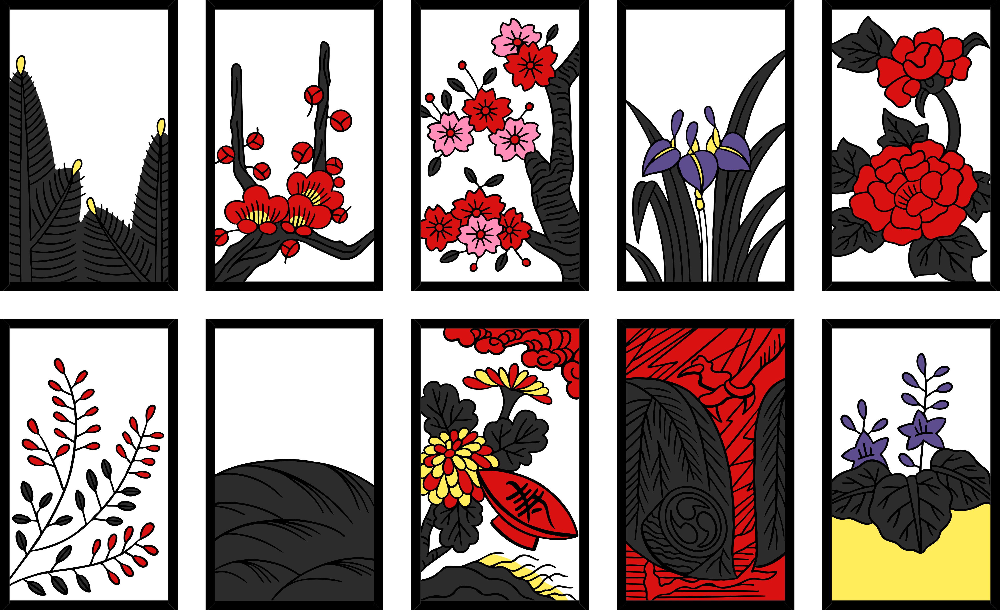

## Card list

**January** - Pine

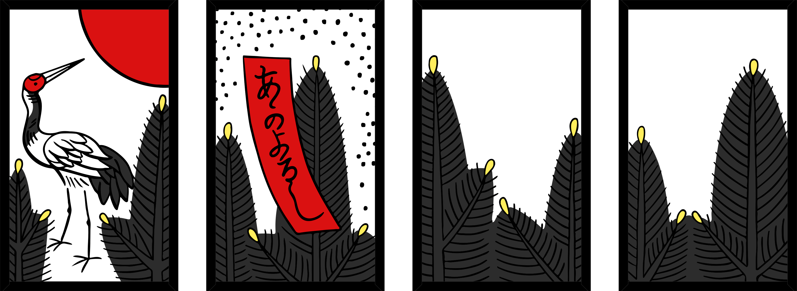
!center: Light (Sun) • Slip (Poetry) • Chaff • Chaff

**February** - Plum Blossom

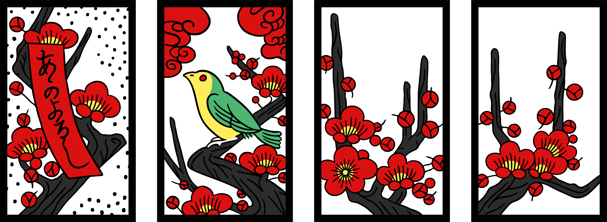
!center: Slip (Poetry) • Animal (Bush warbler) • Chaff • Chaff

**March** - Cherry Blossom

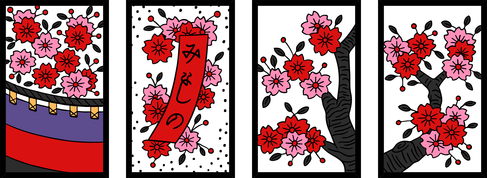
!center: Light (Curtain) • Slip (Poetry) • Chaff • Chaff

**April** - Wisteria

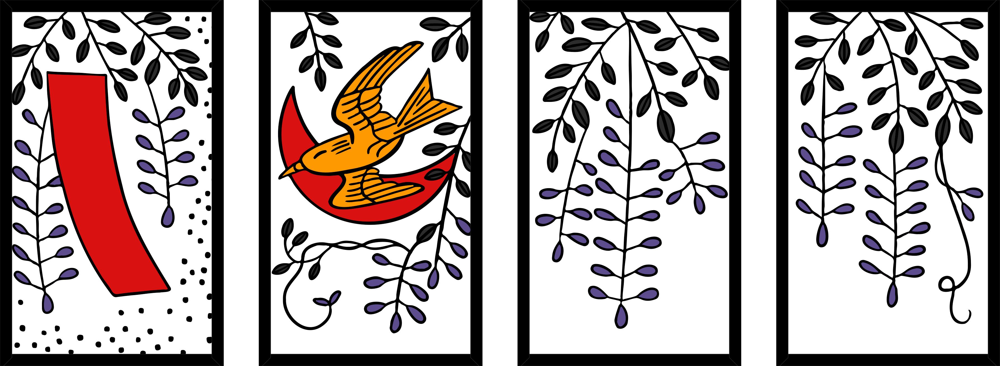
!center: Slip (Red) • Animal (Cuckoo) • Chaff • Chaff

**May** - Iris

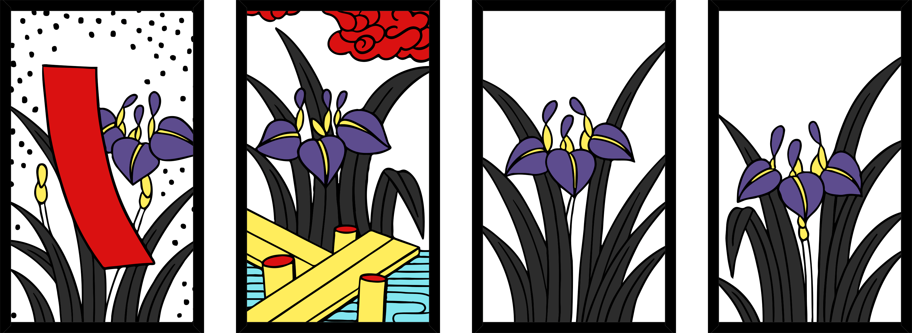
!center: Slip (Red) • Animal (Eight-plank-bridge) • Chaff • Chaff

**June** - Peony

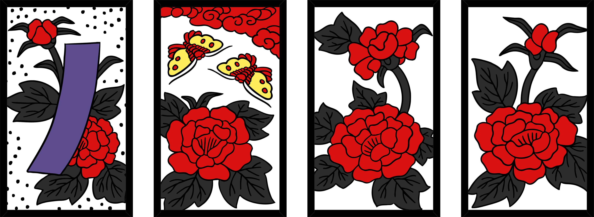
!center: Slip (Blue) • Animal (Butterflies) • Chaff • Chaff

**July** - Bush Clover

!center: Slip (Red) • Animal (Boar) • Chaff • Chaff

**August** - Susuki Grass

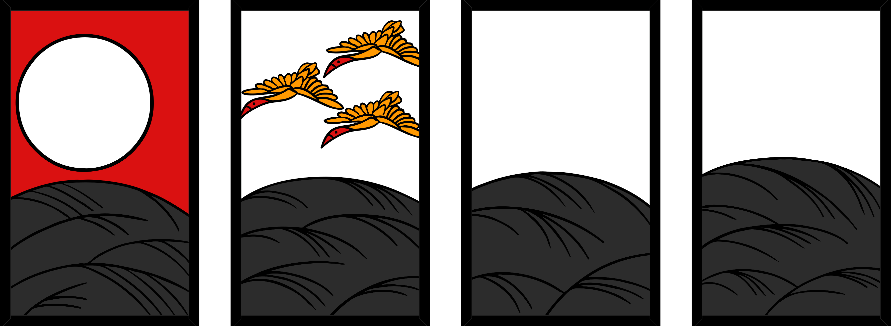
!center: Light (Moon) • Animal (Geese) • Chaff • Chaff

**September** - Chrysanthemum

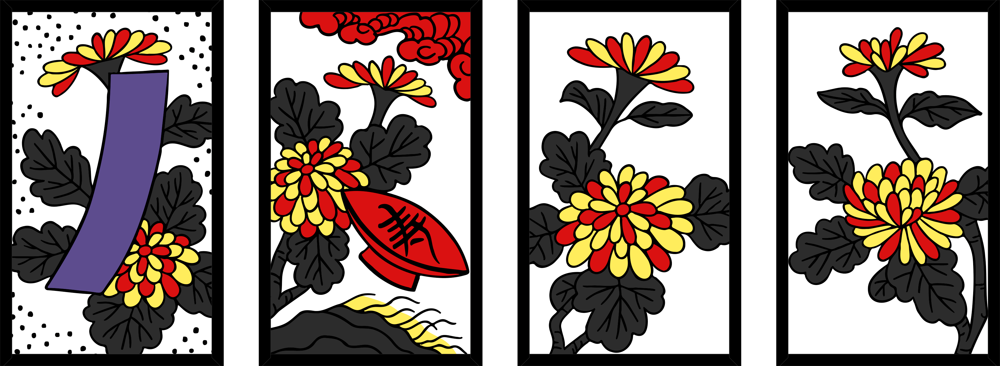
!center: Slip (Blue) • Animal/Chaff (Sake Cup) • Chaff • Chaff

**October** - Maple

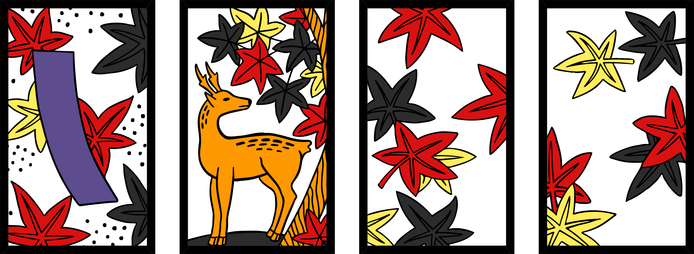
!center: Slip (Blue) • Animal (Deer) • Chaff • Chaff

**November** - Willow

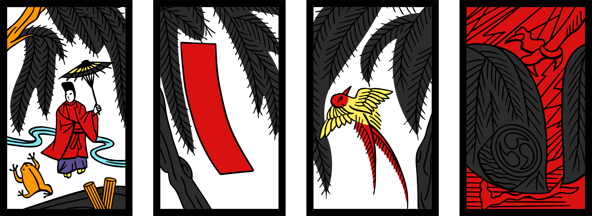
!center: Light (Rain Man) • Slip (Red) • Animal (Swallow) • Chaff

**December** - Paulownia

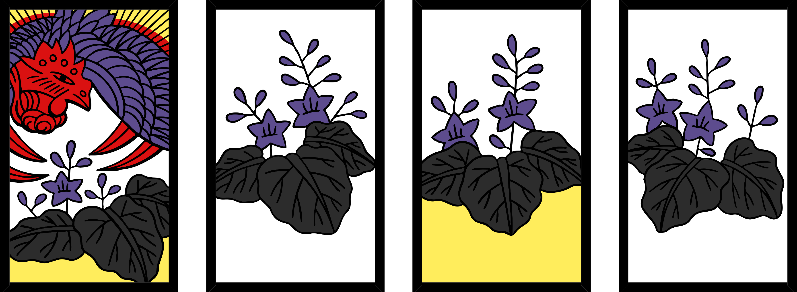
!center: Light (Dragon) • Chaff • Chaff • Chaff

## Note-worthy cards
There are 3 note-worthy cards:

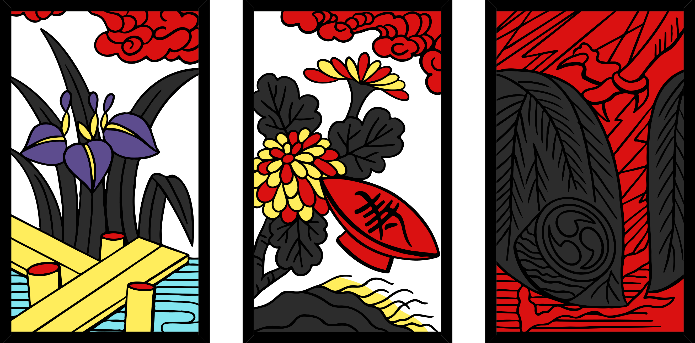

- The Eight-Plank-Bridge is an Animal card, despite it not depicting one.
- The Sake Cup card is both an Animal card and a Chaff card.
- The Lightning card is in the November suit, despite it appearing not to depict any willow at a glance.
