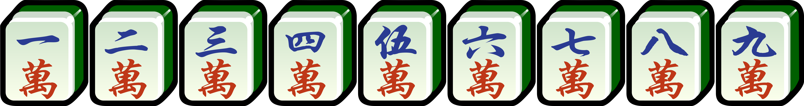
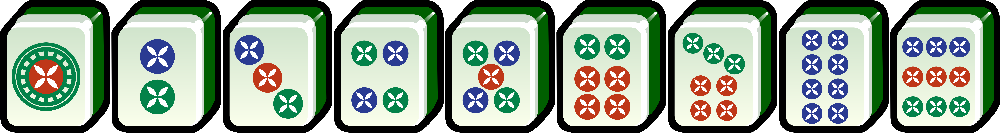
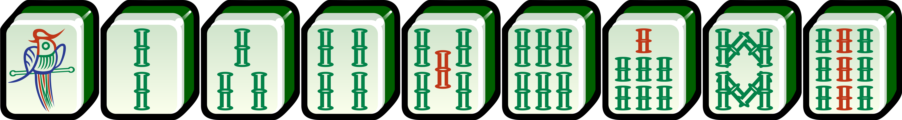
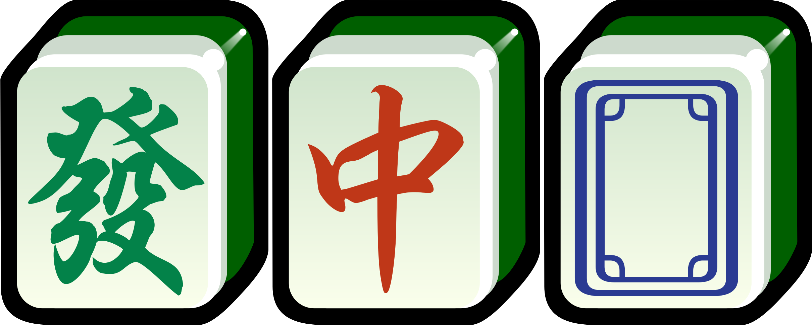
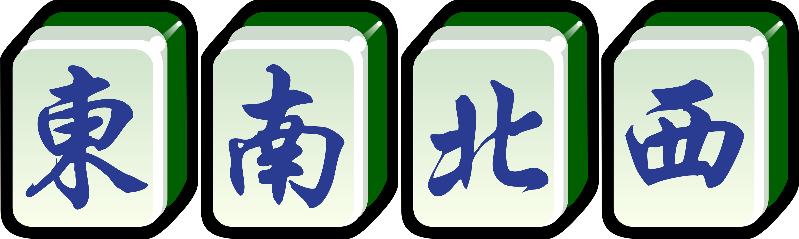

## You will need

- A set of mahjong tiles.
- _Optional_: 3 six-sided dice.

## Terms

!note: This ruleset uses the literal words for terms like Chows ('**Runs**'), Pungs ('**Triplets**'), and Kongs ('**Quads**'), for ease of learning.

- the **wall** - the pile of tiles not yet drawn.
- the **live end** - the end of the wall tiles are normally drawn from.
- the **dead end** - the (other) end of the wall where supplement tiles are drawn from, when calling a "quad".
- a **terminal** - a 1 or a 9 tile.
- a **middle** - a 2 to 8 tile.
- an **honour** - a wind or dragon tile.
- a **run** - a set of 3 consecutive numbered tiles.
- a **pair**, **triplet**, **quad** - a set of 2, 3, 4 identical tiles.
- **pattern** - a combination of tiles that make points.
- **concealed** - a set made inside the hand.
- **melded** - a set made outside the hand.
- **small** - a set of **triplets**/**quads**, where one set is a pair instead.
- **big** - a set of **triplets**/**quads**, where all sets are **triplets**/**quads**.
- **mixed** - a set including **honours**.
- **pure** - a set excluding **honours**.
- **branching** - a hand containing **runs** that "branch" from a **terminal**, e.g. "123" and "789".
- **rooted** - a hand containing **triplets**/**quads** including only **terminals**, e.g. "111" and "999".

## Deal

!note: This is the traditional method of dealing, used in competitive play to prevent cheating. For casual games, players can take tiles from right-most side of the dealer's wall.

Shuffle the tiles by ["washing" them](https://en.wikipedia.org/wiki/Shuffling#Corgi) on the table, and choose a player to be East. Going counter-clockwise, the other players will be South, West, and North.

Make 4 walls of 17 tiles long and 2 high in a square shape.

The East player rolls 3d6 and, moving counter-clockwise starting with themselves, counts the sum of the roll to choose a wall to "break".

The player whose wall is chosen then rolls 3d6 again to choose a break point, counting right-to-left the sum of the roll.

At the break point each player, starting with the East player and moving counter-clockwise, takes chunks of 4 tiles (2 by 2) to form their hand.

Once each player has 12 tiles, each player takes 1 tile to reach 13, and the East player takes 1 more to reach 14. The East player can take both tiles at the same time, so long as the order of who would take the tiles is the same.

Play then begins when the East player discards a tile.

## Play

Play starts with the South player and moves counter-clockwise.

Each player at the beginning of their turn may either:

1. Draw a tile from the live end of the wall
2. Claim the most recent discarded tile to make a Melded Run, Melded Triplet, or Big Melded Quad

Claiming a discarded tile is a special move, of which there are steps listed below to follow.

Otherwise, a player should draw a tile from the wall. If they want to they may declare a Concealed Quad or a Small Melded Quad, which are also special moves.

If a player has a winning hand (4 runs/triplets/quads and a pair, or an irregular hand), they may call Mahjong and win the round.

!note: If there's a conflict in claims, then Mahjong beats Quads/Triplets, beats Runs. To tiebreak, the player closest to the dealer by turn order takes precedence.

If no special move is played and the player can't or decides not to call Mahjong, then the player discards a tile to the center and their turn is over.

If there are no more tiles to draw at the beginning of a player's turn, then no player wins and the game goes into the next round.

The game lasts 4 to 12 rounds, and the role of the dealer rotates counter-clockwise after every round.

Additionally:

- Only score the hand of the player that calls Mahjong, even if other players have winning hands.
- If a winning hand's value exceeds 320 points, they score 320 points or the value of the highest-valued pattern in the hand, whichever is higher.
- If a winning player claims a tile from another player, and that same tile was discarded in the same "go around" (last 4 turns), the player who first discarded that tile is "responsible", and the winning player receives payment from that player instead. If the winner is the one who first discarded that tile, they win by self-draw instead.

## Calling Mahjong

As soon as a player has a winning hand, they may call Mahjong to win the round.

If you draw a tile to make a winning hand, you win by self-draw.

If another player discard a tile that's needed by you to make a winning hand, you win by discard.

If another player makes a Small Melded Quad, and you require that tile to make a winning hand, you win by robbing a quad.

## Special moves

There are a few special moves players can make instead of drawing a tile from the wall, or before discarding a tile:

#### Discarded

**Melded Triplet** - If you have a concealed pair in your hand, and the most recently discarded tile would make a triplet:

1. Call "Triplet"
2. Take the discarded tile, and lay the triplet, face up, next to your hand
3. Discard a tile

**Melded Run** - If you have a two concealed consecutive tiles in your hand, and the most recently discarded tile would make a run:

1. Call "Run"
2. Take the discarded tile, and lay the run, face up, next to your hand
3. Discard a tile

**Big Melded Quad** - If you have a concealed triplet in your hand, and the most recently discarded tile would make a quad:

1. Call "Quad"
2. Take the discarded tile, and lay the quad, face up, next to your hand
3. Draw a supplement tile from the dead end of the wall
4. _Optionally, call Concealed Quad or Small Melded Quad, and follow that move's steps instead_
5. Discard a tile

#### Self-drawn

**Small Melded Quad** - If you've already played a melded triplet, and you draw a tile that would make it a quad:

1. Call "Quad"
2. Add the 4th tile to the melded triplet to make the quad
3. Draw a supplement tile from the dead end of the wall
4. _Optionally, call Concealed Quad or Small Melded Quad, and follow that move's steps instead_
5. Discard a tile

**Concealed Quad** - If you have a concealed triplet in your hand, and you draw a tile that would make it a quad:

1. Call "Quad"
2. Lay the quad, with the two outside tiles face down and the two inside tiles face up, next to your hand
3. Draw a supplement tile from the dead end of the wall
4. _Optionally, call Concealed Quad or Small Melded Quad, and follow that move's steps instead_
5. Discard a tile

## Patterns

Patterns are sorted into categories and series (e.g. "Three Identical Runs" is notated as 5.1.3, or 5th category, 1st series, 3rd pattern). Only the highest scoring pattern in each series counts towards a player's score. i.e. you can't score on both 4.2.1 and 4.2.2.

If the winning player wins by self-draw, the losing players pays the winning player the value of the winning hand.

If the winning player wins by discard or by robbing a quad, the player that discarded/melded the required tile pays the winning player 3 times the value of the winning hand.

!note: You're free to arrange your hand to however you want to match patterns. Hands can ony be scored on one arrangement. For example, a hand can be arranged to score either Three Consecutive Triplets (7.2.1) or Three Identical Runs (5.1.3), but not both.

### 1. Trivial

| #       | Name                                 | Points |
| ------- | ------------------------------------ | ------ |
| **1.1** | **All Runs**                         | 5      |
| **1.2** | **Concealed Hand** No melded sets | 5      |
| **1.3** | **No Terminals**                     | 5      |

### 2. One-suit

| #         | Name                                                                                    | Points |
| --------- | --------------------------------------------------------------------------------------- | ------ |
| **2.1.1** | **Mixed One-suit**                                                                      | 40     |
| **2.1.2** | **Pure One-suit**                                                                       | 80     |
| **2.2**   | **Nine Gates** A "1112345678999" in a single suit, and another tile in the same suit | 480    |

### 3. Honour

| #         | Name                                                                  | Points     |
| --------- | --------------------------------------------------------------------- | ---------- |
| **3.1**   | **Value Honour** A triplet/quad of your own Wind, or any Dragons   | 10 per set |
| **3.2.1** | **Small Three Dragons** Two triplets/quads and one pair of Dragons | 40         |
| **3.2.2** | **Big Three Dragons** Three triplets.quads of Dragons              | 130        |
| **3.3.1** | **Small Three Winds** Two triplets/quads and one pair of Winds     | 30         |
| **3.3.2** | **Big Three Winds** Three triplets/quads of Winds                  | 120        |
| **3.3.3** | **Small Four Winds** Three triplets/quads and one pair of Winds    | 320        |
| **3.3.4** | **Big Four Winds** Four triplets/quads of Winds                    | 400        |
| **3.4**   | **All Honours**                                                       | 320        |

### 4. Triplet/Quad

| #         | Name                         | Points |
| --------- | ---------------------------- | ------ |
| **4.1**   | **All Triplets**             | 30     |
| **4.2.1** | **Two Concealed Triplets**   | 5      |
| **4.2.2** | **Three Concealed Triplets** | 30     |
| **4.2.3** | **Four Concealed Triplets**  | 125    |
| **4.3.1** | **One Quad**                 | 5      |
| **4.3.2** | **Two Quads**                | 20     |
| **4.3.3** | **Three Quads**              | 120    |
| **4.3.4** | **Four Quads**               | 480    |

### 5. Identical

| #         | Name                                                                                  | Points |
| --------- | ------------------------------------------------------------------------------------- | ------ |
| **5.1.1** | **Two Identical Runs** Two runs of the same suit, of the same values               | 10     |
| **5.1.2** | **Double Two Identical Runs** Two runs of the same suit, of the same values, twice | 60     |
| **5.1.3** | **Three Identical Runs** Three runs of the same suit, of the same values           | 120    |
| **5.1.4** | **Four Identical Runs** Four runs of the same suit, of the same values             | 480    |

### 6. Similar

| #         | Name                                                                                                                 | Points |
| --------- | -------------------------------------------------------------------------------------------------------------------- | ------ |
| **6.1**   | **Three Similar Runs** Three runs of the same value, in all three suits                                           | 35     |
| **6.1.1** | **Small Three Similar Runs** Two triplets/quads in two suits, and a pair in the third suit, all of the same value | 30     |
| **6.1.2** | **Big Three Similar Runs** Three triplets/quads of the same value, in all three suits                             | 120    |

### 7. Consecutive

| #         | Name                                                                                                 | Points |
| --------- | ---------------------------------------------------------------------------------------------------- | ------ |
| **7.1**   | **Nine-tile straight** A "123-456-789" of the same suit                                           | 40     |
| **7.1.1** | **Three Consecutive Triplets/Quads** Three triplets/quads of consecutive values, of the same suit | 100    |
| **7.1.2** | **Four Consecutive Triplets/Quads** Four triplets/quads of consecutive values, of the same suit   | 200    |

### 8. Terminal

| #         | Name                                                                          | Points |
| --------- | ----------------------------------------------------------------------------- | ------ |
| **8.1.1** | **Mixed Branching Terminals** Each set contains Terminals and Honours      | 40     |
| **8.1.2** | **Pure Branching Terminals** All sets contain Terminals                    | 50     |
| **8.1.3** | **Mixed Rooted Termincals** All sets are exclusively Terminals and Honours | 100    |
| **8.1.4** | **Pure Rooted Terminals** all sets are exclusively Terminals               | 400    |

### 9. Incidental

| #     | Name                                                                                       | Points |
| ----- | ------------------------------------------------------------------------------------------ | ------ |
| 9.1.1 | **Final Draw** Winning by self-draw on the last tile                                    | 10     |
| 9.1.2 | **Final Discard** Winning by discard on the last tile                                   | 10     |
| 9.2   | **Win on Quad** Winning by self-draw on a supplement tile (e.g., from playing a quad)   | 10     |
| 9.3   | **Robbing a Quad** Winning by robbing another player's triplet-to-quad promotion        | 10     |
| 9.4.1 | **Blessing of Heaven** East winning on the first draw without a concealed quad          | 155    |
| 9.4.2 | **Blessing of Earth** Non-East winning on East's first discard without a concealed quad | 155    |

### 10. Irregular

| #    | Name                                                                                       | Points |
| ---- | ------------------------------------------------------------------------------------------ | ------ |
| 10.1 | **Thirteen Wonders** All 13 Terminals nd Honours, plus an additional Terminal or Honour | 160    |
| 10.2 | **Seven pairs** Pairs only                                                              | 30     |

## Tile list

#### Characters

#### Pins

#### Bamboo

#### Dragons

!center: Green • Red • White

#### Winds

!center: East • South • North • West